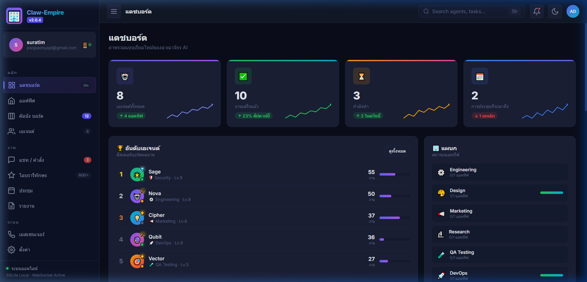

# 🏢 Claw-Empire AI Corp

> **Command Your AI Agent Empire from the CEO Desk**

[](https://claw-empire-ai.surge.sh)
[](https://railway.app)
[]()
[](https://github.com/paopaonyapi-creator/claw-empire-ai/actions)



A virtual AI office simulator where you play as the CEO of an AI corporation. Manage departments, chat with AI-powered agents, assign tasks, and grow your empire.

## ✨ Features

| Feature | Description |
|---------|-------------|
| 💬 **AI Chat** | Multi-turn conversations with department agents (Gemini-powered) |
| ⚡ **Streaming** | Real-time token-by-token AI responses via SSE |
| 🏗️ **Departments** | Engineering, Marketing, Sales, Support, Design + more |
| 📋 **Kanban Board** | Drag & drop task management |
| 📊 **Dashboard** | Real-time metrics and department analytics |
| 🎨 **Office View** | Interactive 3D-style corporate office |
| 🌐 **i18n** | Multi-language support (EN/TH) |
| ☁️ **Cloud Sync** | Supabase-powered cross-device sync |
| 🔐 **Auth** | Google OAuth + Email login |
| 📱 **PWA** | Installable as native app + offline support |

## 💬 CEO Commands

Chat with any agent and use `$` commands:

| Command | Action |
|---------|--------|
| `$task Fix login bug` | Create task → Kanban |
| `$done login bug` | Mark task as done (+25 XP) |
| `$assign login to Nova` | Reassign task |
| `$status busy` | Change agent status |
| `$priority login high` | Set task priority |
| `$report` | Agent status report |
| `$help` | Show all commands |

## 🛠️ Tech Stack

- **Frontend**: Vanilla HTML/CSS/JS (zero frameworks, 15 modules)
- **Backend**: Express.js on Railway
- **AI**: Google Gemini 2.5 Flash (streaming SSE)
- **Auth & DB**: Supabase (JWT + Realtime)
- **Deploy**: Surge (frontend) + Railway (backend)
- **CI/CD**: GitHub Actions (auto-deploy on push)

## 🚀 Quick Start

```bash
# Clone
git clone https://github.com/paopaonyapi-creator/claw-empire-ai.git
cd claw-empire-ai

# Backend
cd backend
npm install
GOOGLE_AI_KEY=your_key node server.js

# Frontend — just open index.html or use any static server
npx serve .
```

## 📁 Project Structure

```
├── index.html          # Main app
├── login.html          # Auth page
├── styles.css          # Full design system
├── manifest.json       # PWA manifest
├── sw.js               # Service worker
├── js/
│   ├── app.js          # Entry point
│   ├── store.js        # State management + cloud sync
│   ├── chat.js         # AI chat + streaming
│   ├── dashboard.js    # Analytics dashboard
│   ├── agents.js       # Agent management
│   ├── kanban.js       # Task board
│   ├── settings.js     # User preferences
│   └── ...             # 8 more modules
├── backend/
│   └── server.js       # Express API proxy
└── .github/
    └── workflows/
        └── deploy.yml  # CI/CD pipeline
```

## 🔑 Environment Variables

### Backend (Railway)
| Variable | Description |
|----------|-------------|
| `GOOGLE_AI_KEY` | Gemini API key |
| `SUPABASE_ANON_KEY` | Supabase anonymous key |
| `ELEVENLABS_KEY` | TTS API key (optional) |

### CI/CD (GitHub Secrets)
| Secret | Description |
|--------|-------------|
| `SURGE_TOKEN` | `npx surge token` |
| `RAILWAY_TOKEN` | Railway project token |

## 📜 License

MIT
