# 🏗️ แผนผังการทำงานทั้งหมด — Claw-Empire

---

## 1️⃣ ภาพรวมระบบ

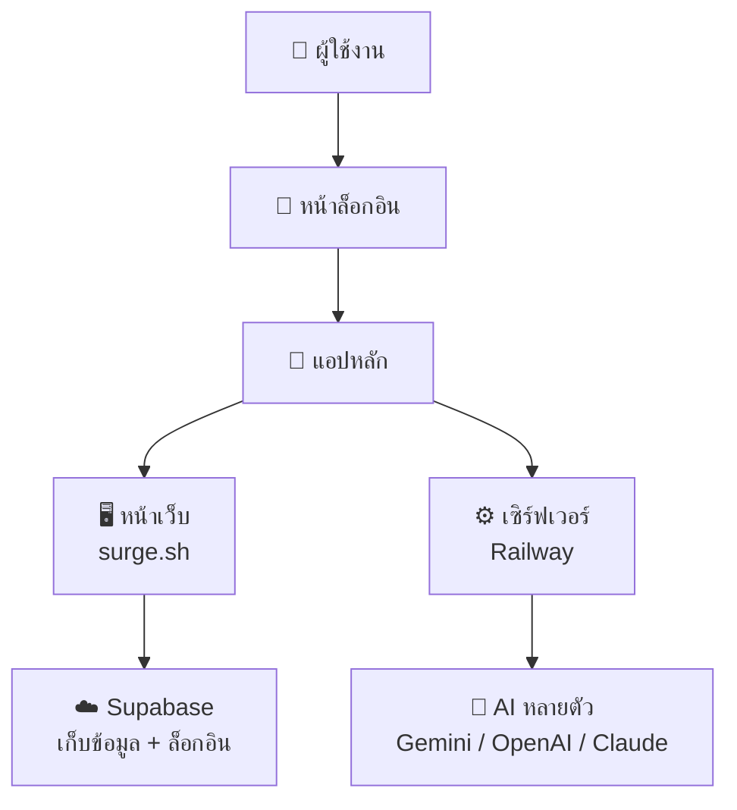

---

## 2️⃣ ขั้นตอนการล็อกอิน

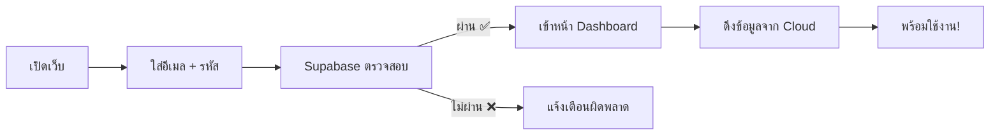

---

## 3️⃣ เมนูทั้งหมด (11 แท็บ)

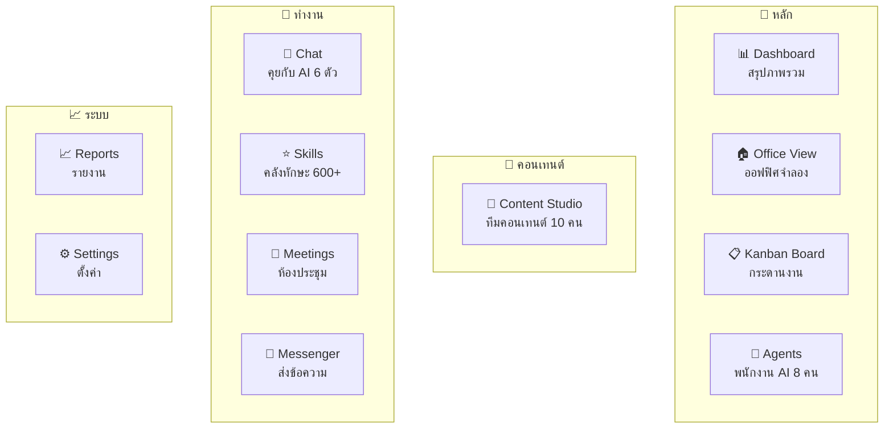

---

## 4️⃣ การเก็บข้อมูล

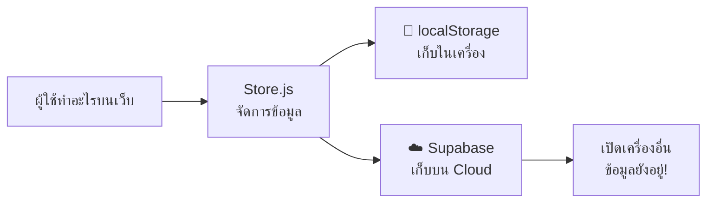

**ข้อมูลที่เก็บ:**
- พนักงาน AI 8 คน (เลเวล, XP, อารมณ์)
- งานบน Kanban (สถานะ, ลำดับความสำคัญ)
- คอนเทนต์ทั้งหมด (ไอเดีย → โพสต์แล้ว)
- เหรียญ, XP, ชื่อเสียง
- ประวัติแชท
- การตั้งค่า (ธีม, ภาษา)

---

## 5️⃣ ระบบ AI แชท

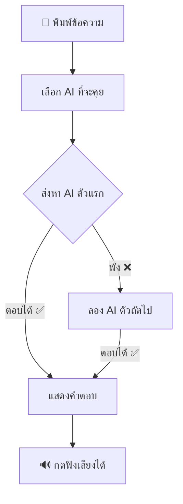

**AI 6 ตัวที่ใช้ได้:**

| ตัว | ชื่อ | ใช้ทำอะไร |
|-----|------|----------|
| 🌟 | **Gemini** | หลัก — ใช้ทุกอย่าง |
| 🟢 | **OpenAI** | สำรอง — ผ่านเซิร์ฟเวอร์ |
| 🟣 | **Claude** | สำรอง — ผ่านเซิร์ฟเวอร์ |
| 🟠 | **NVIDIA** | สำรอง — Llama |
| 🔵 | **DeepSeek** | สำรอง — เชื่อมตรง |
| 🌙 | **Kimi** | สำรอง — เชื่อมตรง |

---

## 6️⃣ Content Studio — ทีมคอนเทนต์ AI

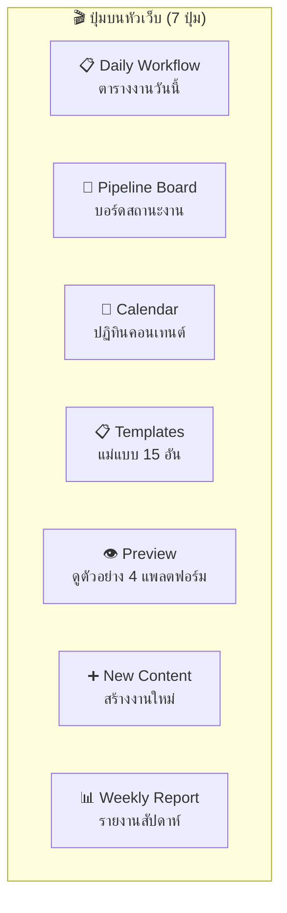

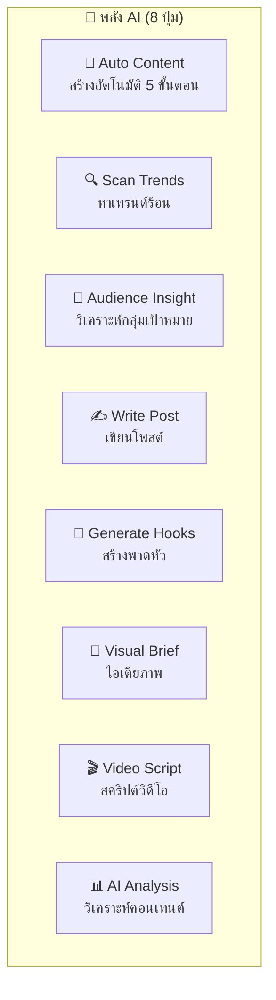

---

## 7️⃣ Auto Content — ระบบสร้างคอนเทนต์อัตโนมัติ

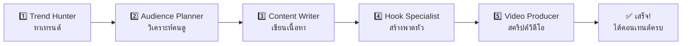

> กด **🚀 Auto Content** ครั้งเดียว → AI 5 ตัวทำงานต่อเนื่อง → ได้ผลลัพธ์ครบทุกขั้นตอน

---

## 8️⃣ Pipeline — สถานะคอนเทนต์

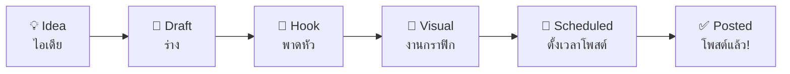

---

## 9️⃣ ระบบเกม (Gamification)

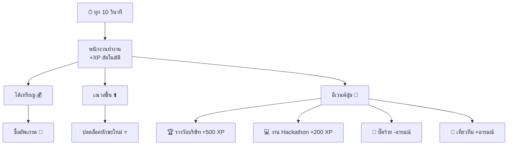

---

## 🔟 ทีมพนักงาน Content (10 ตำแหน่ง)

| # | ตำแหน่ง | หน้าที่ | เวลาทำงาน |
|---|---------|--------|-----------|
| 1 | **Chief Content Strategist** | วางแผนใหญ่ ตั้งเป้าหมาย | 10:00 |
| 2 | **Trend Hunter** | ส่องเทรนด์ จับประเด็นร้อน | 09:00 |
| 3 | **Audience Insight Planner** | วิเคราะห์กลุ่มเป้าหมาย | 09:30 |
| 4 | **Content Writer** | เขียนโพสต์ บทความ สคริปต์ | 10:30 |
| 5 | **Hook & Copy Specialist** | สร้างพาดหัว CTA | 11:00 |
| 6 | **Visual Designer** | ทำกราฟิก Thumbnail | 11:30 |
| 7 | **Video Script Producer** | เขียน/ตัดต่อวิดีโอ | 13:00 |
| 8 | **Content Calendar Manager** | จัดตารางโพสต์ | ทั้งวัน |
| 9 | **Publisher** | กดโพสต์ตามเวลา | 17:00 |
| 10 | **Publisher (รอบดึก)** | กดโพสต์รอบดึก | 20:00 |

---

## 📁 สรุปไฟล์ทั้งหมด

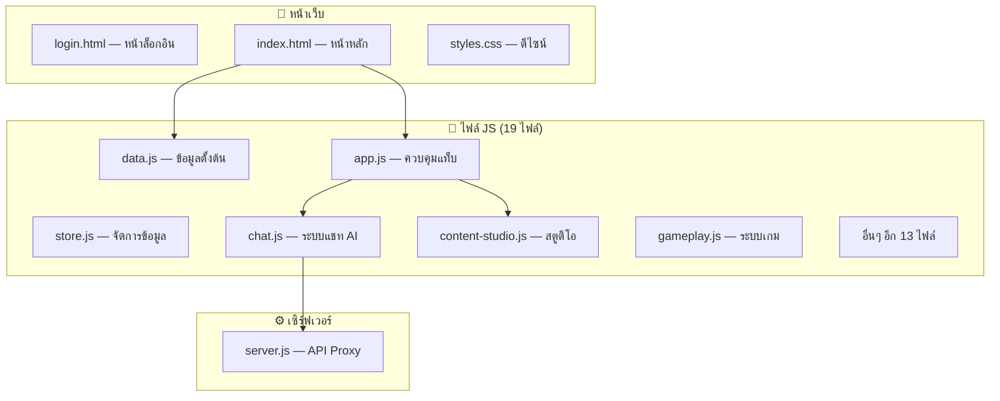
